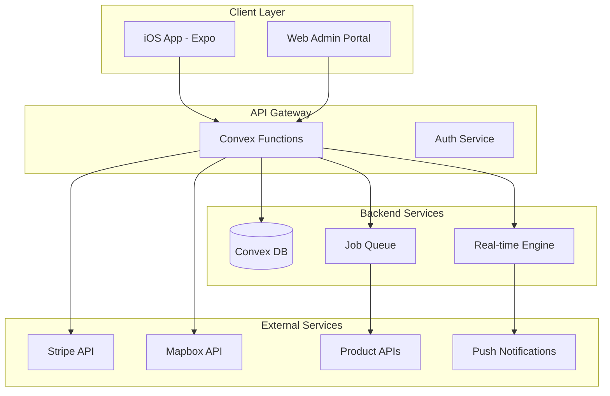
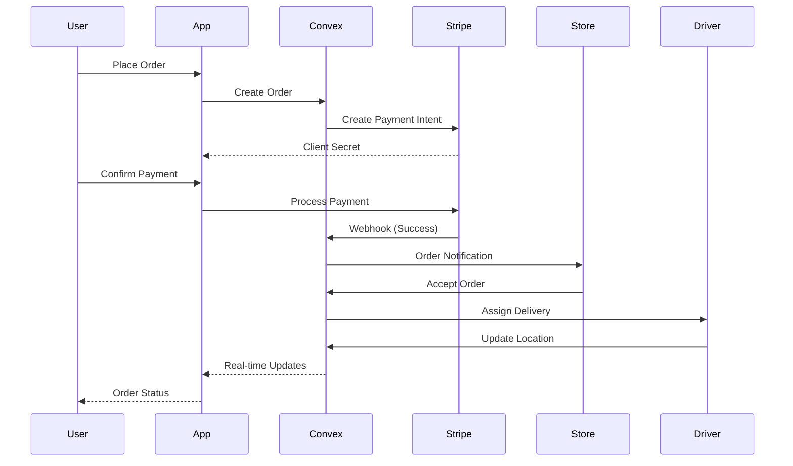

# Architecture Documentation - GreekMarket

## System Architecture Overview



## Technology Stack Details

### Frontend Architecture

#### Expo App Structure
```
app/
├── (auth)/
│   ├── login.tsx
│   ├── register.tsx
│   └── forgot-password.tsx
├── (tabs)/
│   ├── index.tsx          # Home/Discovery
│   ├── map.tsx           # Map View
│   ├── search.tsx        # Search & Filter
│   ├── cart.tsx          # Shopping Cart
│   └── profile.tsx       # User Profile
├── product/
│   └── [id].tsx          # Product Details
├── store/
│   └── [id].tsx          # Store Details
├── order/
│   ├── checkout.tsx      # Checkout Flow
│   └── [id].tsx          # Order Tracking
└── _layout.tsx           # Root Layout

components/
├── common/
│   ├── Button.tsx
│   ├── Card.tsx
│   ├── Input.tsx
│   └── LoadingState.tsx
├── product/
│   ├── ProductCard.tsx
│   ├── ProductList.tsx
│   ├── RatingStars.tsx
│   └── FilterSheet.tsx
├── map/
│   ├── MapView.tsx
│   ├── StoreMarker.tsx
│   └── RouteOverlay.tsx
└── cart/
    ├── CartItem.tsx
    ├── CartSummary.tsx
    └── DeliveryOptions.tsx

hooks/
├── useAuth.ts
├── useLocation.ts
├── useProducts.ts
├── useCart.ts
└── useConvex.ts

utils/
├── api.ts
├── constants.ts
├── helpers.ts
└── validators.ts

stores/
├── authStore.ts
├── cartStore.ts
└── uiStore.ts
```

#### State Management Pattern
```typescript
// Using Zustand for local state management
import { create } from 'zustand';
import { persist } from 'zustand/middleware';

interface CartStore {
  items: CartItem[];
  addItem: (item: CartItem) => void;
  removeItem: (id: string) => void;
  updateQuantity: (id: string, quantity: number) => void;
  clearCart: () => void;
  getTotalPrice: () => number;
}

export const useCartStore = create<CartStore>()(
  persist(
    (set, get) => ({
      items: [],
      addItem: (item) => set((state) => ({
        items: [...state.items, item]
      })),
      removeItem: (id) => set((state) => ({
        items: state.items.filter(item => item.id !== id)
      })),
      updateQuantity: (id, quantity) => set((state) => ({
        items: state.items.map(item =>
          item.id === id ? { ...item, quantity } : item
        )
      })),
      clearCart: () => set({ items: [] }),
      getTotalPrice: () => {
        const { items } = get();
        return items.reduce((sum, item) => sum + (item.price * item.quantity), 0);
      }
    }),
    {
      name: 'cart-storage',
    }
  )
);
```

### Backend Architecture

#### Convex Schema Design
```typescript
// convex/schema.ts
import { defineSchema, defineTable } from "convex/server";
import { v } from "convex/values";

export default defineSchema({
  // Core entities with indexes for performance
  users: defineTable({
    email: v.string(),
    name: v.string(),
    phone: v.optional(v.string()),
    avatar: v.optional(v.string()),
    role: v.string(), // customer, admin, partner
    preferences: v.object({
      language: v.string(),
      currency: v.string(),
      notifications: v.object({
        push: v.boolean(),
        email: v.boolean(),
        sms: v.boolean(),
      }),
    }),
    metadata: v.object({
      lastLogin: v.number(),
      totalOrders: v.number(),
      totalSpent: v.number(),
    }),
  })
    .index("by_email", ["email"])
    .index("by_role", ["role"]),

  products: defineTable({
    // Basic info
    name: v.string(),
    nameEn: v.string(),
    category: v.string(),
    subcategory: v.string(),
    barcode: v.optional(v.string()),
    
    // Details
    description: v.string(),
    descriptionEn: v.string(),
    images: v.array(v.string()),
    
    // Specifications
    brand: v.string(),
    origin: v.object({
      country: v.string(),
      region: v.string(),
      producer: v.optional(v.string()),
    }),
    
    // Category-specific data
    wineData: v.optional(v.object({
      type: v.string(), // red, white, rosé
      grapeVariety: v.array(v.string()),
      vintage: v.number(),
      alcoholContent: v.number(),
      servingTemp: v.object({
        min: v.number(),
        max: v.number(),
      }),
    })),
    
    cheeseData: v.optional(v.object({
      type: v.string(), // hard, soft, semi-hard
      milk: v.string(), // cow, goat, sheep
      aging: v.string(),
      fatContent: v.number(),
    })),
    
    oliveOilData: v.optional(v.object({
      type: v.string(), // extra virgin, virgin, refined
      acidity: v.number(),
      harvestYear: v.number(),
      oliveVariety: v.array(v.string()),
    })),
    
    // Metadata
    active: v.boolean(),
    featured: v.boolean(),
    tags: v.array(v.string()),
    createdAt: v.number(),
    updatedAt: v.number(),
  })
    .index("by_category", ["category"])
    .index("by_barcode", ["barcode"])
    .searchIndex("search_products", {
      searchField: "name",
      filterFields: ["category", "active"],
    }),

  // Inventory with real-time updates
  inventory: defineTable({
    productId: v.id("products"),
    storeId: v.id("stores"),
    price: v.number(),
    comparePrice: v.optional(v.number()), // Original price for discounts
    currency: v.string(),
    inStock: v.boolean(),
    quantity: v.optional(v.number()),
    unit: v.string(), // piece, kg, liter
    minOrder: v.optional(v.number()),
    maxOrder: v.optional(v.number()),
    lastRestocked: v.optional(v.number()),
    nextRestock: v.optional(v.number()),
  })
    .index("by_product", ["productId"])
    .index("by_store", ["storeId"])
    .index("by_product_store", ["productId", "storeId"]),
});
```

#### Service Layer Architecture
```typescript
// convex/services/productService.ts
import { query, mutation } from "../_generated/server";
import { v } from "convex/values";

export const searchProducts = query({
  args: {
    query: v.string(),
    filters: v.object({
      category: v.optional(v.string()),
      priceRange: v.optional(v.object({
        min: v.number(),
        max: v.number(),
      })),
      inStock: v.optional(v.boolean()),
      rating: v.optional(v.number()),
      distance: v.optional(v.number()),
      userLocation: v.optional(v.object({
        lat: v.number(),
        lng: v.number(),
      })),
    }),
    sort: v.optional(v.string()),
    pagination: v.object({
      page: v.number(),
      limit: v.number(),
    }),
  },
  handler: async (ctx, args) => {
    // Complex search implementation with:
    // 1. Full-text search
    // 2. Filter application
    // 3. Distance calculation
    // 4. Sorting
    // 5. Pagination
  },
});
```

### Data Flow Architecture

#### Real-time Updates Flow
```typescript
// Real-time inventory updates
export const subscribeToInventory = {
  args: {
    productIds: v.array(v.id("products")),
    storeIds: v.optional(v.array(v.id("stores"))),
  },
  handler: async function* (ctx, args) {
    // Initial data
    const inventory = await ctx.db
      .query("inventory")
      .withIndex("by_product", (q) => 
        q.in("productId", args.productIds)
      )
      .collect();
    
    yield inventory;
    
    // Watch for changes
    while (true) {
      const updates = await ctx.db.watch(inventory);
      if (updates.length > 0) {
        yield updates;
      }
    }
  },
};
```

#### Order Processing Pipeline


### Security Architecture

#### Authentication & Authorization
```typescript
// middleware/auth.ts
export const requireAuth = async (ctx: QueryCtx | MutationCtx) => {
  const identity = await ctx.auth.getUserIdentity();
  if (!identity) {
    throw new Error("Unauthorized");
  }
  
  const user = await ctx.db
    .query("users")
    .withIndex("by_email", (q) => q.eq("email", identity.email))
    .unique();
    
  if (!user) {
    throw new Error("User not found");
  }
  
  return user;
};

// Role-based access control
export const requireRole = (roles: string[]) => {
  return async (ctx: QueryCtx | MutationCtx) => {
    const user = await requireAuth(ctx);
    if (!roles.includes(user.role)) {
      throw new Error("Insufficient permissions");
    }
    return user;
  };
};
```

#### Data Security Measures
1. **Encryption**
   - All data in transit via HTTPS
   - Sensitive data encrypted at rest
   - Payment data handled by Stripe (PCI compliant)

2. **API Security**
   - Rate limiting per user/IP
   - Request validation
   - CORS configuration
   - API key rotation

3. **User Data Protection**
   - GDPR compliance
   - Data minimization
   - Right to deletion
   - Audit logs

### Performance Optimization

#### Caching Strategy
```typescript
// utils/cache.ts
import AsyncStorage from '@react-native-async-storage/async-storage';

export class CacheManager {
  private static instance: CacheManager;
  private cache: Map<string, { data: any; expiry: number }> = new Map();
  
  static getInstance() {
    if (!this.instance) {
      this.instance = new CacheManager();
    }
    return this.instance;
  }
  
  async get<T>(key: string): Promise<T | null> {
    // Check memory cache first
    const memCache = this.cache.get(key);
    if (memCache && memCache.expiry > Date.now()) {
      return memCache.data;
    }
    
    // Check persistent cache
    const stored = await AsyncStorage.getItem(key);
    if (stored) {
      const { data, expiry } = JSON.parse(stored);
      if (expiry > Date.now()) {
        this.cache.set(key, { data, expiry });
        return data;
      }
    }
    
    return null;
  }
  
  async set(key: string, data: any, ttl: number = 3600000) {
    const expiry = Date.now() + ttl;
    this.cache.set(key, { data, expiry });
    await AsyncStorage.setItem(key, JSON.stringify({ data, expiry }));
  }
}
```

#### Image Optimization
```typescript
// components/OptimizedImage.tsx
import { Image } from 'expo-image';
import { useState } from 'react';

export function OptimizedImage({ source, ...props }) {
  const [error, setError] = useState(false);
  
  const getOptimizedUrl = (url: string, width: number) => {
    // Use image CDN for optimization
    return `https://cdn.greekmarket.gr/optimize?url=${encodeURIComponent(url)}&w=${width}&q=80`;
  };
  
  return (
    <Image
      source={{ uri: getOptimizedUrl(source, props.width || 400) }}
      placeholder={blurhash}
      contentFit="cover"
      transition={200}
      onError={() => setError(true)}
      {...props}
    />
  );
}
```

### Monitoring & Analytics

#### Error Tracking
```typescript
// utils/monitoring.ts
import * as Sentry from '@sentry/react-native';

Sentry.init({
  dsn: process.env.SENTRY_DSN,
  environment: process.env.NODE_ENV,
  tracesSampleRate: 1.0,
  integrations: [
    new Sentry.ReactNativeTracing({
      routingInstrumentation,
      tracingOrigins: ['localhost', /^\//],
    }),
  ],
});

export const logError = (error: Error, context?: any) => {
  Sentry.captureException(error, {
    extra: context,
  });
};
```

#### Analytics Implementation
```typescript
// utils/analytics.ts
import analytics from '@segment/analytics-react-native';

export const trackEvent = (event: string, properties?: any) => {
  analytics.track(event, {
    ...properties,
    timestamp: new Date().toISOString(),
    platform: 'ios',
    appVersion: Constants.manifest.version,
  });
};

// Usage examples
trackEvent('Product Viewed', {
  productId: product.id,
  productName: product.name,
  category: product.category,
  price: product.price,
});

trackEvent('Order Completed', {
  orderId: order.id,
  total: order.total,
  itemCount: order.items.length,
  paymentMethod: 'card',
});
```

### Deployment Architecture

#### CI/CD Pipeline
```yaml
# .github/workflows/deploy.yml
name: Deploy to Production

on:
  push:
    branches: [main]

jobs:
  test:
    runs-on: ubuntu-latest
    steps:
      - uses: actions/checkout@v3
      - uses: actions/setup-node@v3
      - run: npm ci
      - run: npm test
      - run: npm run lint

  deploy-backend:
    needs: test
    runs-on: ubuntu-latest
    steps:
      - uses: actions/checkout@v3
      - name: Deploy to Convex
        run: npx convex deploy --prod
        env:
          CONVEX_DEPLOY_KEY: ${{ secrets.CONVEX_DEPLOY_KEY }}

  build-app:
    needs: test
    runs-on: ubuntu-latest
    steps:
      - uses: actions/checkout@v3
      - uses: expo/expo-github-action@v8
      - run: eas build --platform ios --non-interactive
        env:
          EXPO_TOKEN: ${{ secrets.EXPO_TOKEN }}
```

### Scalability Considerations

1. **Database Sharding**
   - Partition by geographic region
   - Separate read/write databases
   - Cache frequently accessed data

2. **CDN Strategy**
   - Static assets on CloudFront
   - Image optimization service
   - API response caching

3. **Load Balancing**
   - Regional API endpoints
   - Auto-scaling based on traffic
   - Health checks and failover

4. **Background Jobs**
   - Order processing queue
   - Notification dispatch
   - Data synchronization
   - Analytics aggregation 